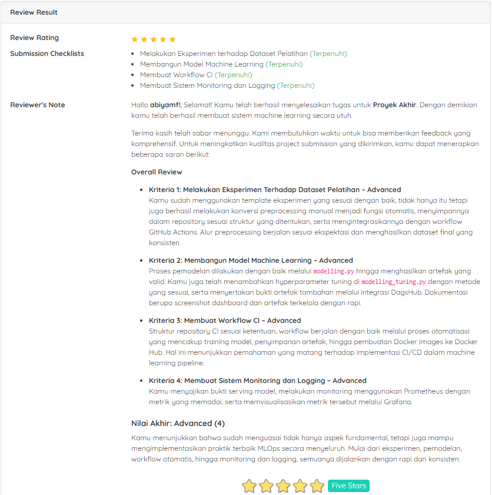

# Proyek Akhir: Membangun Sistem Machine Learning
## Penilaian Proyek
Proyek ini berhasil mendapatkan bintang 5/5 pada submission dicoding course Membangun Sistem Machine Learning.



# 🚀 Membangun Sistem Machine Learning - Medical Insurance Cost Prediction

Selamat datang di repository ini! 🎉 Proyek ini dibuat untuk memenuhi submission **Dicoding: Membangun Sistem Machine Learning**. Proyek ini berfokus pada **prediksi biaya asuransi kesehatan** berdasarkan data demografis dan kebiasaan hidup menggunakan **Machine Learning**.

---

## 📂 Struktur Repository

```
Eksperimen_SML_Nama-siswa/
├── namadataset_raw/                     # Dataset asli (raw dataset)
├── preprocessing/
│   ├── Eksperimen_Nama-siswa.ipynb      # Notebook eksplorasi (EDA & preprocessing manual)
│   ├── automate_Nama-siswa.py           # Script otomatisasi preprocessing (Pipeline)
│   └── namadataset_preprocessing/       # Dataset hasil preprocessing (train/test)
├── Membangun_model/
│   ├── modelling.py                     # Training model (autolog)
│   ├── modelling_tuning.py              # Training dengan hyperparameter tuning (manual logging)
│   ├── screenshoot_dashboard.jpg        # Screenshot MLflow Tracking UI
│   ├── screenshoot_artifak.jpg          # Screenshot artefak model
│   └── requirements.txt                 # Dependencies
├── Workflow-CI.txt                      # Workflow GitHub Actions (CI/CD)
├── Monitoring dan Logging/
│   ├── 1.bukti_serving/                 # Bukti serving model (inference)
│   ├── 2.prometheus.yml                 # Config Prometheus
│   ├── 3.prometheus_exporter.py         # Exporter Flask untuk metrics
│   └── 4.bukti monitoring Prometheus/   # Screenshot monitoring
└── README.md                            # Dokumentasi proyek
```

---

## 📊 Dataset

Dataset diambil dari Kaggle: [Medical Insurance Cost Dataset](https://www.kaggle.com/datasets/mosapabdelghany/medical-insurance-cost-dataset) 📥

* **Jumlah data**: 1338 baris
* **Fitur**:

  * `age`: Umur
  * `sex`: Jenis kelamin
  * `bmi`: Body Mass Index
  * `children`: Jumlah anak
  * `smoker`: Status perokok
  * `region`: Wilayah tempat tinggal
  * `charges`: Biaya asuransi (target)

Dataset digunakan untuk **regression task** → memprediksi nilai `charges`.

---

## ⚙️ Tahapan Proyek

1. **Eksperimen & Preprocessing** 🔬

   * Exploratory Data Analysis (EDA)
   * Handling missing values & duplicate data
   * Normalisasi & encoding fitur kategorikal
   * Outlier detection
   * Pipeline otomatis dengan `scikit-learn` + `joblib`

2. **Membangun Model** 🤖

   * Model dasar: `RandomForestRegressor`
   * Logging dengan **MLflow autolog** (modelling.py)
   * Hyperparameter tuning + manual logging (modelling_tuning.py)
   * Eksperimen dilacak di **MLflow Tracking UI**

3. **Workflow CI/CD** 🔄

   * Menggunakan **GitHub Actions**
   * Preprocessing otomatis setiap kali push branch `main`
   * Hasil preprocessing tersimpan sebagai artefak / commit baru

4. **Monitoring & Logging** 📈

   * Serving model via **MLflow Docker**
   * Monitoring API dengan **Prometheus + Grafana**
   * Metrics yang dipantau: Latency, Throughput, CPU, RAM, Disk, Network

---

## 📦 Instalasi

1. Clone repo ini:

   ```bash
   git clone https://github.com/username/Eksperimen_SML_Nama-siswa.git
   cd Eksperimen_SML_Nama-siswa
   ```

2. Install dependencies:

   ```bash
   pip install -r requirements.txt
   ```

3. Jalankan MLflow Tracking server (opsional):

   ```bash
   mlflow ui --host 127.0.0.1 --port 5000
   ```

---

## ▶️ Menjalankan Workflow

* **Preprocessing otomatis**:

  ```bash
  python preprocessing/automate_Nama-siswa.py
  ```

* **Training model**:

  ```bash
  python Membangun_model/modelling.py
  ```

* **Training dengan hyperparameter tuning**:

  ```bash
  python Membangun_model/modelling_tuning.py
  ```

* **Serving model (Docker)**:

  ```bash
  docker run -p 8080:8080 insurance_model
  ```

* **Inference**:

  ```bash
  python inference.py
  ```

---

## 📡 Monitoring

* Endpoint metrics Prometheus tersedia di: `http://127.0.0.1:8000/metrics`
* Bisa divisualisasikan di **Grafana** untuk:

  * Latency API ⏱️
  * Throughput 🚦
  * CPU, RAM, Disk usage 💻
  * Network traffic 🌐

---

## 🏆 Pencapaian

* ✅ Kriteria 1: Eksperimen manual & otomatisasi preprocessing
* ✅ Kriteria 2: Training model (autolog & tuning)
* ✅ Kriteria 3: Workflow CI/CD + artefak
* ✅ Kriteria 4: Serving + Monitoring dengan Prometheus/Grafana

---

## ✨ Penutup

Proyek ini membuktikan bagaimana membangun end-to-end **Machine Learning System**: mulai dari EDA → Preprocessing → Modelling → CI/CD → Serving → Monitoring.

Semoga bermanfaat! 🙌
